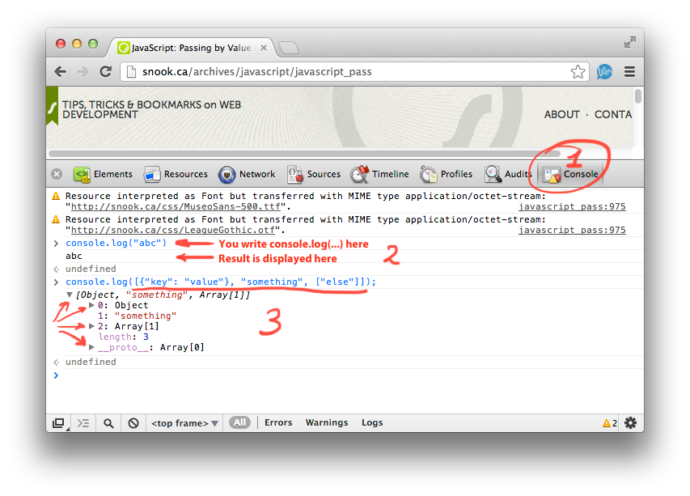

# Задание 2

### Отвлечённо: Автоматизм и интуиция

Вообще, для того чтобы стать ценным промышленным программистом на языке X,
нужно удостоверится, что _аналитические_ способности превращены в _интуитивные_ навыки.

Вопрос «надо запрограммировать X» не должен приводить к необходимости
анализа того, какими примитивами (функциями, классами) мы должны
воспользоваться, а должен направляться прямо в мозжечок, чтобы пальцы, не
отвлекая мозг, сами набрали на клавиатуре то, что нужно, оставляя аналитической
части мозга пространство для проработки архитектуры и других высокоуровневых
соображений.

Для культивирования интуиции и автоматизма традиционно применяют метод
«[делай что-то десять тысяч часов, станешь профессионалом](http://en.wikipedia.org/wiki/Outliers_(book))».
То есть, надо просто делать какие-то вещи раз за разом, и через такую простую
процедуру с течением времени теоретические знания перекочуют в навыки
«на кончиках пальцев».

Голову и аналитику в таком раскладе нужно применять только при изучении
семантики нового языка. Всё остальное придёт с элементарной механической
практикой и повторением.

Поэтому для этого и последующих заданий рекомендую такой подход: если
известно, что можно задачу решить несколькими вариантами — то её и нужно
решать несколькими вариантами, и сдавать (обсуждать) сразу несколько вариантов.
Так будет больше практики. Ключ, ещё раз отмечу, не в факте выполненного
задания (это как раз проще всего добиться на этапе изучения технологии,
пока открыты во вкладках все необходимые справочники),
а в том, чтобы на клавиатуре в процессе решения и перебора вариантов
решения набрано как можно больше кода на языке X.

Разумеется, конечный вариант (варианты) должен оказаться лаконичным
и понятным.

### Введение в JavaScript

Целью данного задания является знакомство или освежение в памяти JavaScript
и общих программистских практик, таких как рекурсивная обработка данных.

#### Основные типы данных

В JavaScript для целей следующего задания можно выделить следующие типы данных:
* [String](http://www.w3schools.com/jsref/jsref_obj_string.asp), строки, `""`,
* [Array](http://www.w3schools.com/jsref/jsref_obj_array.asp), массивы, `[]`, из которых элементы можно брать по известному индексу,
* [Object](), объекты, `{}`, из которых значения можно брать по произвольному текстовому ключу.

Мы можем описывать многие иерархические данные через комбинацию этих и
других типов данных.

* Например, опишем чьё-то имя строкой:

    ```javascript
var s = "Натали Портман";
    ```

* Или опишем полное имя через массив из двух элементов:

 ```javascript
var a = ["Натали", "Портман"];
 ```

* Предыдущий вариант (позиционная запись) плох тем, что мы неявно подразумеваем, что имя находится первым элементом, а фамилия — вторым. Представим, каково будет кому-то читать код типа `var lastName = a[1]` — что это за магическая единица? а что ещё там бывает? Поэтому делаем следующий шаг и уходим от позиционной записи в массиве `[]` к именованным полям в объекте `{}`:

 ```javascript
var o = {
          "name": "Натали",
          "lastName": "Портман"
        };
 ```

 В этом случае мы можем обратиться к фамилии просто обратившись к объекту по
ключу `lastName`: `var lastName = o["lastName"]`. Обратите внимание, что,
к сожалению, синтаксис взятия значения в объекте `{}` по ключу идентичен
синтаксису взятия значения в _массиве_ `[]` по индексу.

* Конечно, объекты и массивы могут быть произвольно вложенными друг в друга.

 ```javascript
var a = [{
          "recordType": "person",
          "occupation": "actor",
          "person": {
                      "name": "Натали",
                      "lastName": "Портман"
                      "homeAddress": ["7060 Hollywood Blvd",
                                      "Los Angeles",
                                      "CA", 90028]
                    }
        },
        {"..."}];
 
 // Возьмём сразу одно из самых вложенных полей:
var lastName = a[0]["person"]["lastName"];
 ```

#### Функции

Функции определяются в JavaScript несколькими способами, но два самых
распространённых таковы:

 ```javascript
var fname1 = function(arg1, arg2) {
                return arg1 + arg2;
             };

function fname1(arg1, arg2) {
    return arg1 + arg2;
};
 ```

 Значения передаются в функцию либо _по ссылке_ (то есть, функция может изменять
какие-то параметры своего аргумента, и эти параметры будут видны снаружи функции), либо _по значению_ (то есть, что бы функция не делала, функция не сможет изменить свой аргумент). «По значению» передаются примитивные значения (строки, числа), «по ссылке» — составные, типа массивов `[]` или объектов `{}`. Подробнее можно почитать в гугле: «[javascript by value by reference](https://www.google.com/search?q=javascript+by+value+by+reference)», или, например, здесь: http://snook.ca/archives/javascript/javascript_pass

#### Отладка JavaScript в браузере

Есть несколько способов отладить JavaScript для браузера:

1. Можно делать изменения в HTML-файле и перезагружать страницу в браузере.

2. Можно иметь кусок кода в отдельном файле и натравливать на него из командной строки [Node.js](http://nodejs.org/), чтобы удостовериться в его правильном поведении.

3. Можно воспользоваться встроенной в браузеры консолью JavaScript. В хроме это выглядит так:

 

 Обратите внимание:
 * Попробуйте в JavaScript-консоли не использовать вызов `console.log()` а ввести сложную структуру данных непосредственно.
 * Попробуйте использовать `console.log()` внутри JavaScript, находящегося внутри вашей HTML-страницы, и посмотрите на результат в браузерной JavaScript-консоли.

В изучении инструментов отладки в браузере очень помогут [курсы от Google на Codeschool: "devtools"](https://www.codeschool.com/courses/discover-devtools).

1. Для решения задач, Вы используете chrome и его инструменты. Это удивительный опыт, очень напоминает игру, игру для программиста = )

2. Курс обзорный, подходит для новичков.

### Задание

1. Придумать и описать структуру данных как минимум пяти уровней вложенности.

2. Из-за того, что злобно запрограммированная функция может иногда
«повреждать» данные, изменяя свои аргументы, иной раз приходится создавать
копию данных перед тем, как подобную функцию вызывать. Напишите вспомогательную
функцию «клонирования», которая бы брала произвольную структуру данных
произвольной вложенности и возвращала полную копию этой структуры.
С помощью консоли убедитесь, что полученные в результате вызова функции
оригинальные данные идентичны данным, которые возвращает функция «клонирования».

3. **Задание со звёздочкой**: сделайте так, чтобы программа продолжала работать
корректно, даже если в начале программы поставить `Object.prototype.foo="bar";`. Используйте [hasOwnProperty](https://developer.mozilla.org/en-US/docs/JavaScript/Reference/Global_Objects/Object/hasOwnProperty).

4. Переименуйте (`git mv`) `index.html` от старого задания в `task-1.html`, и создайте новый `task-2.html`, в котором будет содержаться результат (или несколько результатов) выполнения предыдущих пунктов. Закиньте оба файла на гитхаб.

### Ссылки на источники про JavaScript

Есть замечательный сайт с быстрым погружением в синтаксис JavaScript:
* http://www.codecademy.com/

Всё, что имеется в разделе «JavaScript Objects Reference» на странице
* http://www.w3schools.com/jsref/default.asp

Международный стандарт на JavaScript: ECMA-262.
Рекомендую пробежаться по вершкам, не вникая совсем уж в технические углы.
Рекомендую полностью прочитать все подразделы от 15.4 Array Objects,
разве что игнорируя блоки текста после каждого предложения,
заканчивающегося примерно на "the following steps are taken:".
Это нужно для того, чтобы примерно представлять структуру документа
и иметь возможность в будущем по спорным вопросам обращаться непосредственно
к первоисточнику, а не к вольным пересказам.
* http://www.ecma-international.org/ecma-262/5.1/Ecma-262.pdf

