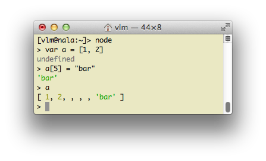
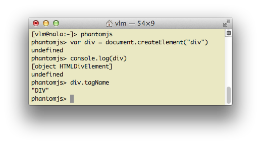

# Задание 3

Давайте сменим инструментарий для разработки.
Отладка мелких скриптов в браузере — далеко не самый эргономичный вариант.
Можно и лучше, и проще, и без мышки.
Давайте установим JavaScript-интерпретатор, который работает
из командной строки. Называется [Node.JS](http://nodejs.org). После установки
проверьте, что он работает:



Если у вас есть под рукой скрипт (например, `script.js`), можно попробовать
запустить его с помощью этого интерпретатора:
 ```sh
node script.js
 ``` 

Но не всегда скрипт будет работать так же, как в браузере. Если скрипт
в браузере использует какие-то браузерские фичи, особенно если пытается
работать с [DOM](http://en.wikipedia.org/wiki/Document_object_model)-представлением HTML-странички, то в `node` такой скрипт
работать не будет и вывалится с ошибкой.

Поэтому для более серьёзных скриптов, которые используют DOM, в будущем можно задействовать чуть более жирный инструмент — [PhantomJS](http://phantomjs.org/).
Этот инструмент — один из категории так называемых _безголовых браузеров_
(headless browsers). Это такой веб браузер, у которого оторвали часть,
ответственную за графическое отображение страницы.
В этом PhantomJS можно использовать DOM:



Попробуйте в Node.JS и в PhantomJS использовать автодополнение:
можно не полностью набирать какой-то метод или ключевое слово,
а, набрав первые несколько символов, нажать клавишу `<Tab>`.

Поставьте один или оба из этих инструментов, они полезны. Node.JS пошустрее
и удобен для тестирования чистого JavaScript. PhantomJS полноценнее
в качестве замены браузеру.

### Document Object Model

Браузер предоставляет JavaScript'у способы управления содержимым HTML-страницы.
Можно изменять и добавлять содержимое, регистрировать обработчики нажатия
клавиш, и т. д.

Вот как можно создать новый HTML-элемент и повесить его на страницу:

 ```html
<!DOCTYPE html>
<head><title>Testing DOM</title></head>
<body>

    <div id="something">Какой-то текст</div>

    <script>

        var someDiv = document.getElementById("something");
        var newDiv = document.createElement("div");

        someDiv.appendChild(newDiv);

    </script>
</body>
</html>
 ```

Эти все `document`, `getElementById`, `createElement`, `appendChild` — это
и есть часть [DOM](http://en.wikipedia.org/wiki/Document_object_model).

### Задание

1. Скопируйте страничку `task-1.html` из первого задания в `task-3.html`.
2. Вставьте в `task-3.html` скрипт, который добавляет в существующий на страничке `<div>` с идентификатором "someId" текст «... и ещё кое-что».
3. Залейте эту новую страницу на гитхаб.

### Ссылки на источники по DOM

* https://developer.mozilla.org/en-US/docs/Gecko_DOM_Reference, а точнее
* https://developer.mozilla.org/en-US/docs/DOM/document

