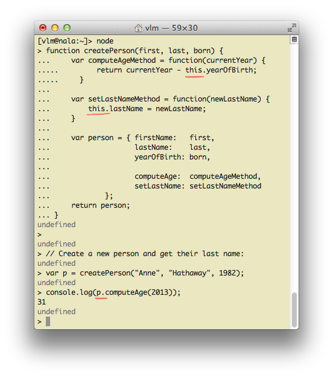
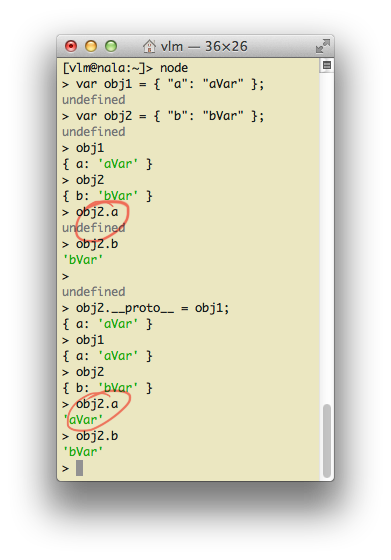
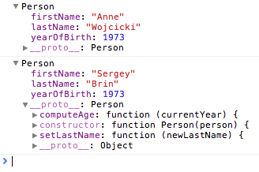

# Объекты

## Объекты и классы в C и C++

Объекты — это сущности, которые обладают идентичностью (identity, возможностью отличить один объект от другого), состоянием (state, аттрибутами, полями), и поведением (behavior, методами, функциями, которые умеют изменять состояние).
Для простоты введения в предмет можно представить объекты существующими
в памяти только после запуска программы экземплярами соответствующих «классов».
Это если мы говорим в терминологии Java, C++ или C#.

Объекты могут порождаться в течении жизни программы, изменяться, исчезать.

Сравните условный код на C и C++:

* **C**

 ```c
 struct Person {
        char *firstName;
        char *lastName;
        int yearOfBirth;
 }
 
 // Compute person's age in a given year.
 void computeAge(struct Person *person, int currentYear);
 
 // Set a new last name, possibly deallocating the old one.
 void setLastName(struct Person *person, char *newLastName);
 ```

* **C++**

 ```cpp
class Person {
       char *firstName;
       char *lastName;
       int yearOfBirth;
  
       void computeAge(int currentYear);
       void setLastName(char *newLastName);
}
 ```

В данных примерах мы на языках C и C++ описали объект Person.
Не «создали объект», а «описали его поля и методы», чтобы потом можно
было такого рода объекты создавать, и пользоваться ими.

Также посмотрите на соответствующие способы создания одного объекта Person
в C и C++:

* **C**

 ```c
 struct Person *p = malloc(sizeof(*p));
 setLastName(p, "Poupkine");
 printf("%s's age is %d\n", computeAge(p, 2013));
 ```

* **C++**

 ```cpp
 Person *p = new Person;
 p->setLastName("Poupkine");
 printf("%s's age is %d\n", p->computeAge(2013));
 ```

Эти две программы делают одно и то же: создают объект и позволяют использовать
ассоциированные с ним функции `setLastName`, `computeAge` (behavior)
для изменения или опроса состояния объекта (state).
К созданному объекту мы в любой момент можем обратиться через указатель `p`
(identity). Если мы создадим ещё один объект `Person *m = new Person`, то
мы сможем использовать методы нового объекта, обращаясь к нему через указатель
`m`. Указатели `p` и `m` будут указывать на разные объекты, каждый со
своим состоянием, хотя и одинаковым набором методов (поведением).

Как мы видим, даже родственные языки C и C++ предлагают немного разные способы
описания объекта Person. В одном случае мы описываем объект через структуру
данных `struct Person` и дружественные функции где-то рядом. В другом случае
мы синтаксически помещаем и данные, и функции в один и тот же `class Person`.

Почему люди могут предпочитать C++ и «объектно-ориентированный подход»,
раз мы примерно одно и то же можем делать и в языке C, «без классов»,
и в языке C++? Есть несколько хороших ответов, которые релевантны в контексте
нашего изучения JavaScript, в котором можно использовать как подход C,
так и подход C++:

1. Пространства имён (namespaces).
В варианте на C мы определили функцию `computeAge`. Эта функция находится в глобальном пространстве имён: она «видна» всей программе.
В другом месте теперь создать такую функцию не получится. А что если мы
сделали новый вид объектов, скажем, `Pony`, и хотим сделать подобный
метод, вычисляющий возраст пони? Нам понадобится не только создать новый
метод `ponyComputeAge()`, но и переименовать старый метод, чтобы добиться
единообразия: `personComputeAge()`. В общем, мы «захламляем»
пространство имён, делая с течением времени создание новых видов объектов
всё более сложным. Если же мы помещаем функцию `computeAge()` в класс, как
в C++, у нас может быть много подобных функций в разных классах. Они не будут
мешать друг другу.

2. Сокрытие информации (information hiding).
В варианте на C, кто имеет указатель `p` на структуру `Person`, тот
может изменить любое поле в объекте. Например, можно сказать `p->yearOfBirth++`.
Так делать — произвольно менять произвольные поля произвольных
объектов — считается плохой практикой. Ведь часто нужно не просто менять
поле, а согласованно менять несколько полей объекта. А кто это может сделать
лучше и корректнее, чем специализированная процедура (метод)? Поэтому стоит
иметь возможность запретить менять поля напрямую, и давать их менять только
с помощью соответствующих методов. На C это сделать сложновато, поэтому
пользуются редко. Но на C++ это сделать элементарно. Достаточно объявить
какие-то атрибуты объекта private, и тогда к ним обращаться можно будет
только изнутри методов класса:
 ```cpp
 class Person {
       // Эти данные могут менять только функции computeAge и setLastName:
       private:
           char *firstName;
           char *lastName;
           int yearOfBirth;
 
       // Эти функции (методы) доступны всем:
       public:
           void computeAge(int currentYear);
           void setLastName(char *newLastName);
 }
 ```

3. Создание интерфейса.
В варианте на C мы вынуждены для каждого объекта помнить, как для него
получить возраст. Для одного объекта мы будем звать `ponyComputeAge()`,
для другого `personComputeAge()`. В варианте на C++ мы можем просто помнить,
что вычисление возраста любого объекта делается через `computeAge()`.
То есть, мы вводим единый интерфейс для вычисления возраста, и используем
его в приложении ко многим объектам. Это удобно.

## Объекты и прототипы в JavaScript

Программисты на JavaScript тоже используют преимущества
объектного программирования, но в нём нет «классов» как синтаксического
способа описания объектов.

### Наивный способ

Можно было бы в JavaScript воспользоваться подходом C, когда мы описываем
объект через структуру данных и набор функций, работающих над данными:

```javascript
function createPerson(first, last, born) {
    var person = { firstName:   first,
                   lastName:    last,
                   yearOfBirth: born };
    return person;
}

function computeAge(p, currentYear) {
    return currentYear - p.yearOfBirth;
}

function setLastName(p, newLastName) {
    p.lastName = newLastName;
}

// Create a new person and get their age:
var p = createPerson("Anne", "Hathaway", 1982);
console.log(p);
console.log(computeAge(p, 2013));
```

Попробуйте скопировать весь этот код в программу `node` (предварительно установив проект Node.JS).

### Расхламляем пространство имён

Но этот способ обладает теми же недостатками варианта на C, который был
указан выше. Давайте попробуем ещё раз, но только в этот раз «засунем»
методы `setLastName()` и `computeAge()` «внутрь» объекта. Этим мы «разгрузим»
глобальное пространство имён, не будем его захламлять:

```javascript
function createPerson(first, last, born) {
    var computeAgeMethod = function(p, currentYear) {
        return currentYear - p.yearOfBirth;
    }

    var setLastNameMethod = function(p, newLastName) {
        p.lastName = newLastName;
    }

    var person = { firstName:   first,
                   lastName:    last,
                   yearOfBirth: born,

                   computeAge:  computeAgeMethod,
                   setLastName: setLastNameMethod
            };
    return person;
}

// Create a new person and get their age:
var p = createPerson("Anne", "Hathaway", 1982);
// Note the p.computeAge(p) syntax, instead of just computeAge(p).
console.log(p.computeAge(p, 2013));
console.log(p["computeAge"](p, 2013));
```

Обратите внимание на то, что мы просто перенесли функции извне
createPerson вовнутрь. Тело функции не изменилось. То есть, каждая
функция всё ещё ожидает аргумент `p`, с которым она будет работать.
Способ вызова этих методов практически не изменился: да, нужно вместо
вызова глобальной функции `computeAge` вызывать метод объекта `p.computeAge`,
но всё равно функция ожидает `p` первым аргументом.

Это довольно избыточно. Воспользуемся следующим трюком: как и в C++, Java
и других языках, в JavaScript есть специальное переменная `this`. Если функция
вызывается сама по себе (`f()`), то эта переменная указывает «в пустоту».
Но если функция вызывается через точку, как метод какого-либо объекта,
(`p.f()`), то ей в качестве this передаётся указатель на этот самый объект `p`.
Так как мы всё равно будем вынуждены вызывать методы через обращение
к соответствующим полям объекта (`p.computeAge`), то в методах `this`
уже будет существовать и выставлен в правильное значение `p`. Перепишем
код с использованием этого знания. Также попробуйте скопировать его в
`node`.

```javascript
function createPerson(first, last, born) {
    var computeAgeMethod = function(currentYear) {
        return currentYear - this.yearOfBirth;
    }

    var setLastNameMethod = function(newLastName) {
        this.lastName = newLastName;
    }

    var person = { firstName:   first,
                   lastName:    last,
                   yearOfBirth: born,

                   computeAge:  computeAgeMethod,
                   setLastName: setLastNameMethod
            };
    return person;
}

// Create a new person and get their age:
var p = createPerson("Anne", "Hathaway", 1982);
console.log(p.computeAge(2013));
```



### Прототипы

Получившаяся функция `createPerson` обладает следущим недостатком: она
работает не очень быстро, и тратит много памяти каждый раз при создании объекта.
Каждый раз при вызове `createPerson` JavaScript конструирует две новых
функции, и присваивает их в качестве значений полям "computeAge"
и "setLastName".

Как бы сделать так, чтобы не создавать эти функции каждый раз заново?
Как сделать так, чтобы в объекте, на который ссылается `person`, полей
`computeAge`, и `setLastName` не было, но при этом методы
`person.computeAge()` и `person.setLastName()` продолжали работать?

Для решения как раз этой проблемы в JavaScript есть механизм под названием
«прототипы», а точнее «цепочки прототипов» (prototype chains).
Концепция простая: если у объекта нет собственного метода или поля, то 
движок JavaScript пытается найти это поле у прототипа. А если поля нет
у прототипа, то поле пытаются найти у прототипа прототипа. И так далее.
Попробуйте «покрутить» следующий код в Node.JS, скопировав его в `node`:

```javascript
var obj1 = { "a": "aVar" };
var obj2 = { "b": "bVar" };
obj1
obj2
obj2.a
obj2.b

obj2.__proto__ = obj1;
obj1
obj2
obj2.a
obj2.b
```



Мы видим, что если указать, что прототипом объекта `obj2` является
объект `obj1`, то в `obj2` «появляются» свойства объекта obj1, такие как
поле "a" со значением "aVar". При этом JSON.stringify(obj2) не покажет
наличие атрибута "a" в объекте.

Поэтому можно методы сделать один раз, положить их в прототип, а
`createPerson` преобразовать так, чтобы воспользоваться этим прототипом:

```javascript
function createPerson(first, last, born) {
    var person = { firstName:   first,
                   lastName:    last,
                   yearOfBirth: born };
    person.__proto__ = personPrototype;
    return person;
}

var personPrototype = {
    "computeAge":   function(currentYear) {
                        return currentYear - this.yearOfBirth;
                    }, // обратите внимание на запятую

    "setLastName":  function(newLastName) {
                        this.lastName = newLastName;
                    }
}

// Create a new person and get their age:
var p = createPerson("Anne", "Hathaway", 1982);
console.log(p);
console.log(p.computeAge(2013));
```

Попробуйте этот код в `node`. Обратите внимание, какой простой объект, без
собственных методов, показывается через `console.log(p)`.
И что у этого простого объекта всё равно работает метод `computeAge`.

У этого способа задания прототипа объекта есть два недостатка. Первый,
что специальный атрибут `__proto__` очень новый, и может не поддерживаться
браузерами. Второй недостаток таков, что даже перестав захламлять пространство
имён функциями `computeAge` и `setLastName` мы всё равно его загадили именем
`personPrototype`.

К счастью на выручку приходит ещё один трюк JavaScript, который стандартен
и совместим со всеми браузерами.

Если любую функцию вызвать не просто по имени `f()`, а через `new f()`,
то происходят две вещи:
1. создаётся новый объект `{}`, и this у функции начинает показывать на него.
2. другой объект, на который показывает имеющийся у в любой функции атрибут
`.prototype`, автоматически станет прототипом объекта из пункта 1.
Иными словами, код выше эквивалентен вот этому коду:

```javascript
function createPerson(first, last, born) {
    this.firstName   = first;
    this.lastName    = last;
    this.yearOfBirth = born;
    return this;
}

createPerson.prototype = {
    "computeAge":   function(currentYear) {
                        return currentYear - this.yearOfBirth;
                    }, // обратите внимание на запятую
    
    "setLastName":  function(newLastName) {
                        this.lastName = newLastName;
                    }
}

// Create a new person and get their age:
var p = new createPerson("Anne", "Hathaway", 1982);
console.log(p);
console.log(p.computeAge(2013));
```

Обратите внимание на следующие аспекты:

* мы вызываем `new createPerson` вместо `createPerson`;
* мы устанавливаем прототипный объект один раз извне функции, чтобы не конструировать функции каждый раз при вызове createPerson;
* мы не забываем возвращать this из createPerson.

В принципе, можно не менять целиком объект, на который указывает `createPerson.prototype`, а просто по-отдельности установить ему нужные поля. Эту идиому тоже
можно встретить в промышленном JavaScript-коде:

```javascript
createPerson.prototype.computeAge = function(currentYear) {
    return currentYear - this.yearOfBirth;
}
createPerson.prototype.setLastName = function(newLastName) {
    this.lastName = newLastName;
}
```

### Надстраиваем jQuery

Обратите внимание, что тело функции `createPerson` вместо простого и
понятного
 ```javascript
function createPerson(first, last, born) {
    var person = { firstName:   first,
                   lastName:    last,
                   yearOfBirth: born };
    return person;
}
 ```
превратилось в довольно ужасную последовательность манипуляции с `this`:
 ```javascript
function createPerson(first, last, born) {
    this.firstName   = first;
    this.lastName    = last;
    this.yearOfBirth = born;
    return this;
}
 ```

Мы можем исправить эту ситуацию с помощью функции [jQuery.extend](http://lmgtfy.com/?q=jquery+api+extend), которая просто копирует поля из одного объекта
в другой:

```javascript
function createPerson(first, last, born) {
    var person = { firstName:   first,
                   lastName:    last,
                   yearOfBirth: born });
    return $.extend(this, person);
}
```

Кроме того, мы можем и не передавать кучу полей аргументами функции,
а передавать на вход функции объект с уже нужными нам полями:


```javascript
function createPerson(person) {
    return $.extend(this, person);
}

var p = new createPerson({ firstName: "Anne",
                           lastName: "Hathaway",
                           yearOfBirth: 1982 });
console.log(p);
```

(К сожалению, из-за необходимости использовать jQuery, этот код проще всего
пробовать уже в браузере, а не в терминале с `node`.)

Этот код уже выглядит просто и компактно. Но почему мы создаём
«новый createPerson»? Пора переименовать метод в более подходящее имя:

```javascript
function Person(person) {
    return $.extend(this, person);
}

Person.prototype.computeAge = function(currentYear) {
    return currentYear - this.yearOfBirth;
}
Person.prototype.setLastName = function(newLastName) {
    this.lastName = newLastName;
}

var anne = new Person({ firstName: "Anne",
                        lastName: "Wojcicki",
                        yearOfBirth: 1973 });
var sergey = new Person({ firstName: "Sergey",
                          lastName: "Brin",
                          yearOfBirth: 1973 });
console.log(anne);
console.log(sergey);
```

Вот как это выглядит в консоли Safari:



Такая форма записи уже очень похожа на то, как записывается и работает
класс в C++, поэтому в JavaScript функцию `Person` иногда называют классом.
Например, можно сказать: «у класса Person есть метод computeAge».

# Задание

1. Посмотрите на то, как устроен [task-6.html](task-6.html).
2. Посмотрите на стандартные JavaScript функции setInterval и setTimeout.
3. Создайте новый «класс» Wobbler, который принимает в качестве аргумента
DOM-элемент, который нужно колебать с помощью JavaScript. В этом объекте
нужно иметь и обслуживать свой собственный таймер, который через каждые
16 миллисекунд обновляет угол поворота указанного DOM-элемента.
4. Колебания можно сделать, воспользовавшись функцией синуса (Math.sin).
Каждый раз, когда вызывается таймер, нужно приращивать какую-то величину
на небольшое значение, вычислять от этой величины синус, и преобразовывать
этот синус в нужный угол наклона.
5. **Задание со звёздочкой**. Функция `Wobbler` должна кроме DOM-элемента принимать диапазон значений угла поворота, между крайними значениями которого происходят колебания. Примерно так: `new Wobbler(div, -45, 45)`.

P.S. Не путайте DOM-элемент (указатель на объект) и строку, которая является
CSS-селектором: идентификатором, классом или HTML-тэгом. Wobbler должен
принимать на вход ссылку на DOM-элемент, а не строку.

